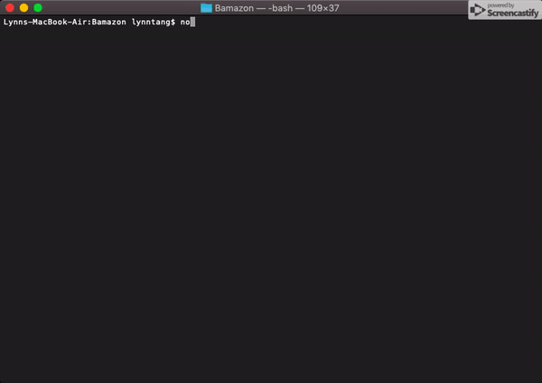

# Bamazon
## What it is 
An Amazon-like storefront application inside of your terminal. It uses node to fun and MySQL to store data.

## Getting started
1. Clone this repository in your terminal:

with SSH:
```
git clone git@github.com:lynnjamin/Bamazon.git
```

Go to the root of the Bamazon folder. Use the following command to install all the dependencies:
```
npm install
```

2. Run the `bamazon.sql` inside your MySQL.

3. Run one of the following commands for different modes:
``` 
node bamazonCustomer.js
node bamazonManager.js
```

# What it looks like
## Customer
After running `bamazonCustomer.js` the following will occur:
1. A table of the most current inventory will be displayed. It contains product names, IDs, departments, prices, and stock.
2. You will be prompted to enter the ID of the product you want to buy.
3. You will be asked how many units of that item want to buy.
4. The table will be updated and your total of how much you spent will be displayed. 
**NOTE**: You cannot buy more than what the inventory has.


<br>

## Built With
- [MySQL](https://www.mysql.com/)
- [Inquirer NPM Package](https://www.npmjs.com/package/inquirer)
- [CLI-Table NPM Package](https://www.npmjs.com/package/cli-table)

## Created By:
**Lynn Tang**

## Acknowledgements
* The Coding Boot Camp at UT Austin for giving me the challenge of making this app
